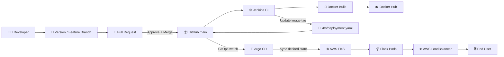
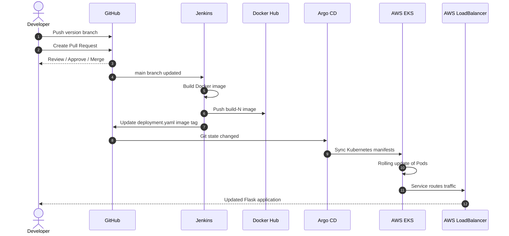
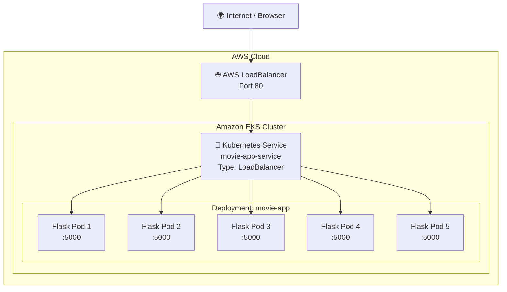
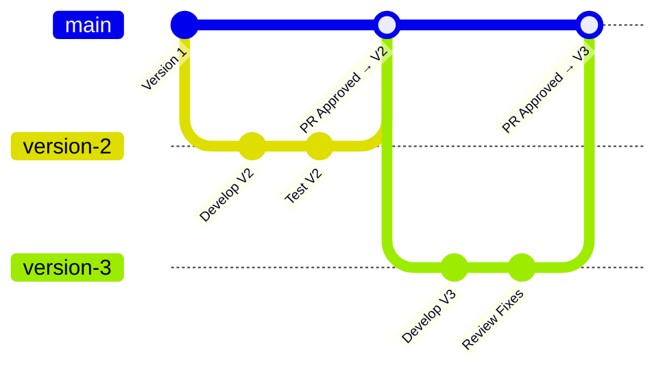
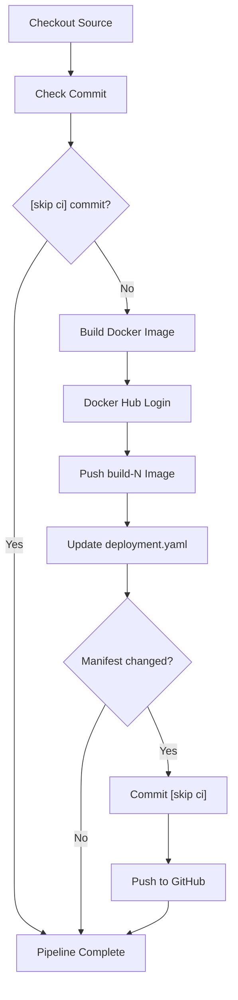
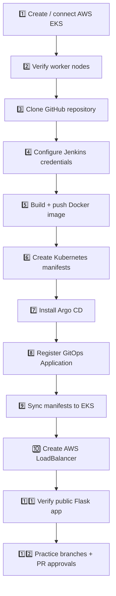

<div align="center">

# 🚀 Multi-Branch Flask App
### Jenkins CI • Docker • GitHub PR Workflow • Argo CD GitOps • Kubernetes • AWS EKS

<p>
  A hands-on DevOps project that takes a Python Flask application from
  <strong>source code → review → container image → GitOps deployment → public AWS LoadBalancer</strong>.
</p>


**Repository:** `rahmanuddinmd/Multi-Branch-Prod`  
**Container Image:** `rahmanuddinmd17/multibranch-flask-app`

</div>

---

## ✨ Project Overview

This repository is a practical DevOps learning project built around a Python Flask web application.

Instead of manually rebuilding and redeploying the application after every change, the project uses a CI/CD + GitOps workflow:

1. A developer creates a version/feature branch.
2. Changes are reviewed through a GitHub Pull Request.
3. After approval and merge to `main`, Jenkins builds a new Docker image.
4. Jenkins pushes the image to Docker Hub.
5. Jenkins updates the image tag inside `k8s/deployment.yaml`.
6. Argo CD detects the Git change.
7. Argo CD synchronizes the new desired state to AWS EKS.
8. Kubernetes performs the rollout.
9. The application is exposed through an AWS LoadBalancer.

> **Core idea:** Git is the source of truth for the Kubernetes deployment state.

---

# 🏗️ End-to-End Architecture



---

# 🔄 CI/CD + GitOps Flow



---

# 🌐 Kubernetes + LoadBalancer Architecture



### Traffic path

```text
Browser
   ↓
AWS Elastic Load Balancer
   ↓
Kubernetes Service :80
   ↓
targetPort :5000
   ↓
Flask Pods
```

---

# 🌿 Versioning & Pull Request Workflow

This project can be used to practice a real team-style branch and review process.



### Example: Version 1 → Version 2

```bash
git checkout main
git pull origin main

git checkout -b version-2

# Edit app.py

git add app.py
git commit -m "Add Version 2 application changes"
git push -u origin version-2
```

Create a Pull Request:

```text
base:    main
compare: version-2
```

Reviewer/Admin flow:

```text
Review code
   ↓
Request changes (if required)
   ↓
Developer updates branch
   ↓
Approve Pull Request
   ↓
Merge into main
   ↓
Jenkins CI starts
   ↓
Argo CD deploys the approved version
```

### Version 3

Always start from the newest `main`:

```bash
git checkout main
git pull origin main
git checkout -b version-3
```

Then repeat the same **change → commit → push → PR → review → merge → deploy** process.

---

# 🧰 Technology Stack

| Layer | Technology | Purpose |
|---|---|---|
| Application | Python 3.11 + Flask | Web application |
| Source Control | Git + GitHub | Version control and PR reviews |
| CI | Jenkins | Build and release automation |
| Container | Docker | Application packaging |
| Registry | Docker Hub | Container image storage |
| Orchestration | Kubernetes | Workload management |
| Cloud | AWS EKS | Managed Kubernetes cluster |
| CD / GitOps | Argo CD | Continuous synchronization |
| Networking | AWS LoadBalancer | Public application access |

---

# 📁 Repository Structure

```text
Multi-Branch-Prod/
│
├── app.py                     # Flask web application
├── Dockerfile                 # Container image definition
├── Jenkinsfile                # CI pipeline
├── requirements.txt           # Python dependencies
│
├── k8s/
│   ├── deployment.yaml        # Kubernetes Deployment
│   └── service.yaml           # LoadBalancer Service
│
└── argocd/
    └── application.yaml       # Argo CD Application
```

---

# 🧪 Application

The Flask app listens on:

```text
0.0.0.0:5000
```

The Docker image repository is:

```text
rahmanuddinmd17/multibranch-flask-app
```

Jenkins uses build-number based image tags:

```text
build-1
build-2
build-3
build-4
...
```

Example:

```text
rahmanuddinmd17/multibranch-flask-app:build-4
```

---

# 🐳 Docker Workflow

## Build

```bash
docker build \
  -t rahmanuddinmd17/multibranch-flask-app:local .
```

## Run locally

```bash
docker run --rm \
  -p 5000:5000 \
  rahmanuddinmd17/multibranch-flask-app:local
```

Open:

```text
http://localhost:5000
```

---

# ⚙️ Jenkins Pipeline

The CI pipeline follows this flow:



## Jenkins Credentials

Configure the following credentials in Jenkins:

| Credential ID | Type | Used For |
|---|---|---|
| `dockerhub-creds` | Username + secret | Docker Hub login/push |
| `github-creds` | Username + PAT | GitHub checkout/push |

> Never hard-code passwords, Personal Access Tokens, or Docker credentials inside the repository.

---

# ☸️ AWS EKS / Kubernetes

## Verify cluster nodes

```bash
kubectl get nodes
```

Expected state:

```text
STATUS
Ready
```

## Apply manifests manually

Argo CD normally handles deployment, but for testing:

```bash
kubectl apply -f k8s/
```

## Verify application

```bash
kubectl get deployment movie-app
kubectl get pods
kubectl get svc movie-app-service
kubectl rollout status deployment/movie-app
```

The Deployment is configured for multiple replicas, allowing Kubernetes to distribute application traffic across Pods.

---

# 🌐 Check the Public Application

Get the AWS LoadBalancer hostname:

```bash
kubectl get svc movie-app-service
```

Example output pattern:

```text
NAME                TYPE           EXTERNAL-IP
movie-app-service   LoadBalancer   <aws-elb-dns-name>
```

Test from terminal:

```bash
curl http://<aws-elb-dns-name>
```

Or open:

```text
http://<aws-elb-dns-name>
```

---

# 🔄 Argo CD GitOps

Argo CD watches this repository:

```yaml
source:
  repoURL: https://github.com/rahmanuddinmd/Multi-Branch-Prod.git
  targetRevision: main
  path: k8s
```

Automated synchronization is enabled:

```yaml
syncPolicy:
  automated:
    prune: true
    selfHeal: true
```

This means:

- **Self Heal** — Argo CD can restore drifted Kubernetes resources to the Git-defined state.
- **Prune** — resources removed from Git can also be removed from the cluster.

---

# 🧩 Argo CD Installation

Create the namespace:

```bash
kubectl create namespace argocd
```

Install Argo CD:

```bash
kubectl apply -n argocd \
  --server-side \
  --force-conflicts \
  -f https://raw.githubusercontent.com/argoproj/argo-cd/stable/manifests/install.yaml
```

Verify:

```bash
kubectl get pods -n argocd
```

Check CRDs:

```bash
kubectl get crd | grep argoproj
```

Expected resources include:

```text
applications.argoproj.io
applicationsets.argoproj.io
appprojects.argoproj.io
```

Apply this project's Argo CD application:

```bash
kubectl apply -f argocd/application.yaml
```

Verify:

```bash
kubectl get applications -n argocd
```

Healthy state:

```text
SYNC STATUS      HEALTH STATUS
Synced           Healthy
```

---

# 🖥️ Argo CD Dashboard

For this learning environment, the Argo CD server can be exposed with a LoadBalancer:

```bash
kubectl patch svc argocd-server \
  -n argocd \
  -p '{"spec":{"type":"LoadBalancer"}}'
```

Get the endpoint:

```bash
kubectl get svc argocd-server -n argocd
```

Open:

```text
https://<argocd-load-balancer-dns>
```

Initial username:

```text
admin
```

Get the initial password:

```bash
kubectl -n argocd \
  get secret argocd-initial-admin-secret \
  -o jsonpath="{.data.password}" | base64 -d && echo
```

> ⚠️ **Lab note:** Exposing the Argo CD admin UI directly with a public LoadBalancer is convenient for learning. For production, prefer controlled ingress, trusted TLS, SSO/RBAC, and restricted network access.

---

# 🧭 What We Implemented — Step by Step



---

# ✅ Deployment Verification Checklist

### EKS

```bash
kubectl get nodes
```

- [ ] Worker nodes show `Ready`

### Flask Application

```bash
kubectl get pods
```

- [ ] `movie-app` Pods show `Running`
- [ ] Containers show `1/1`

### Deployment

```bash
kubectl rollout status deployment/movie-app
```

- [ ] Rollout completed successfully

### Application LoadBalancer

```bash
kubectl get svc movie-app-service
```

- [ ] External AWS hostname is assigned

### Argo CD

```bash
kubectl get pods -n argocd
kubectl get applications -n argocd
```

- [ ] Argo CD Pods are `Running`
- [ ] Application is `Synced`
- [ ] Application is `Healthy`

### GitOps

- [ ] Jenkins pushed a new Docker image
- [ ] Jenkins updated `k8s/deployment.yaml`
- [ ] Argo CD detected the commit
- [ ] EKS rolled out the new image

---

# 🔍 Useful Troubleshooting Commands

## Application Pods

```bash
kubectl get pods -o wide
kubectl describe pod <pod-name>
kubectl logs <pod-name>
```

## Deployment

```bash
kubectl describe deployment movie-app
kubectl rollout history deployment/movie-app
kubectl rollout status deployment/movie-app
```

## Application Service

```bash
kubectl get svc movie-app-service
kubectl describe svc movie-app-service
kubectl get endpoints movie-app-service
```

## Argo CD

```bash
kubectl get pods -n argocd
kubectl get applications -n argocd
kubectl describe application movie-app -n argocd
kubectl logs -n argocd deployment/argocd-server --tail=100
```

---

# 🧠 Key DevOps Concepts Practiced

- CI vs CD
- GitOps
- Immutable Docker image tagging
- Branch-based development
- Pull Request review
- Secret management in Jenkins
- Kubernetes Deployments
- Kubernetes Services
- Rolling updates
- AWS LoadBalancers
- EKS worker nodes
- Argo CD automated synchronization
- Configuration drift and self-healing
- End-to-end deployment verification

---

# 🔐 Production Hardening Ideas

This repository is designed primarily for learning. For a production-grade environment, consider adding:

- Protected `main` branch
- Required PR approvals
- Automated unit/integration tests
- Docker image vulnerability scanning
- Kubernetes readiness/liveness probes
- CPU and memory requests/limits
- Kubernetes Secrets or AWS Secrets Manager
- HTTPS with a trusted certificate
- Ingress / AWS Load Balancer Controller
- Restricted Argo CD network access
- SSO + RBAC for Argo CD
- Jenkins least-privilege credentials
- Centralized monitoring with Prometheus/Grafana
- Centralized application and cluster logging
- Image retention / cleanup policy
- Separate development, staging, and production environments

---

# 🎯 Learning Outcome

By completing this project, the full software delivery chain becomes visible:

```text
Developer
   ↓
Git Branch
   ↓
Pull Request
   ↓
Review + Merge
   ↓
Jenkins CI
   ↓
Docker Image
   ↓
Docker Hub
   ↓
Git Manifest Update
   ↓
Argo CD
   ↓
AWS EKS
   ↓
Kubernetes Pods
   ↓
AWS LoadBalancer
   ↓
Live Application
```

This is the central learning goal of the repository: understanding how source control, CI, containers, GitOps, Kubernetes, and AWS work together as one deployment system.

---

<div align="center">

## 👨‍💻 Maintainer

**Rahmanuddin MD**

[](https://github.com/rahmanuddinmd)

### ⭐ If this project helped you learn DevOps, consider starring the repository.

</div>
